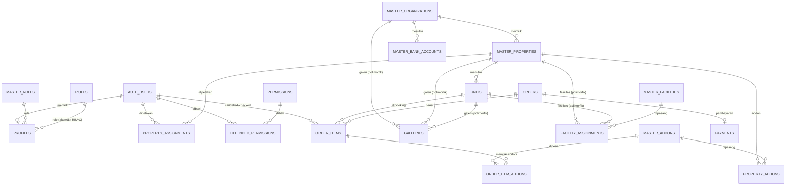

# Entity Relationship Diagram (ERD)

> Status: **Work in Progress** — mengikuti schema di `database_design/schema/` dan `database_design/init/init.sql`.

Diagram ini menggambarkan relasi antar tabel pada sistem booking properti (guest house) dengan dukungan booking inap & transit, multi-organisasi, multi-properti, guest checkout, dan RBAC.

## Diagram (Mermaid)



## Legenda Relasi

| Simbol | Arti |
|--------|------|
| `||--o|` | One-to-one (1 : 1) |
| `||--o{` | One-to-many (1 : N) |
| `}o--o{` | Many-to-many (N : N) via junction table |

## Renormalisasi Grouping

```text
Layer 1 — MASTER DATA
    master_roles, master_facilities, master_organizations,
    master_properties, master_bank_accounts, master_addons, master_charges

Layer 2 — PROFIL, AKSES & INVENTORI
    profiles, units, galleries, property_addons

Layer 3 — ASSIGNMENT
    facility_assignments, property_assignments

Layer 4 — TRANSAKSI OPERASIONAL
    orders, order_items, order_item_addons, payments

Layer 5 — AUDIT & RBAC (ALT)
    activity_logs, roles, permissions, extended_permissions
```

---

## Entitas & Atribut

### 1. Layer Master Data

#### `master_roles`
| Kolom | Tipe | Keterangan |
|-------|------|------------|
| `id` (PK) | smallint | Identity primary key |
| `code` | varchar(25) | Kode unik (`anonymous`, `customer`, `staff`, `manager`, `administrator`, `superadmin`) |
| `name` | varchar(25) | Nama role |
| `description` | text | Deskripsi |
| `is_active` | boolean | Soft-delete |
| `created_at`, `updated_at` | timestamptz | Audit |

#### `master_facilities`
| Kolom | Tipe | Keterangan |
|-------|------|------------|
| `id` (PK) | smallint | Identity primary key |
| `code` | varchar(25) | Kode unik |
| `name` | varchar(100) | Nama fasilitas |
| `icon_url` | text | Ikon |
| `description` | text | Deskripsi |
| `is_active` | boolean | Soft-delete |
| `created_at`, `updated_at` | timestamptz | Audit |

#### `master_organizations`
| Kolom | Tipe | Keterangan |
|-------|------|------------|
| `id` (PK) | uuid | Primary key |
| `name` | varchar(255) | Nama organisasi |
| `slug` | varchar(255) | Slug unik |
| `description` | text | Deskripsi |
| `is_active` | boolean | Soft-delete |
| `created_at`, `updated_at` | timestamptz | Audit |

#### `master_properties`
| Kolom | Tipe | Keterangan |
|-------|------|------------|
| `id` (PK) | uuid | Primary key |
| `master_organizations_id` (FK) | uuid | → `master_organizations.id` |
| `name` | varchar(255) | Nama properti |
| `slug` | varchar(255) | Slug unik |
| `address` | text | Alamat |
| `contact_wa` | text | Kontak WhatsApp |
| `description` | text | Deskripsi |
| `is_active` | boolean | Soft-delete |
| `created_at`, `updated_at` | timestamptz | Audit |

#### `master_bank_accounts`
| Kolom | Tipe | Keterangan |
|-------|------|------------|
| `id` (PK) | uuid | Primary key |
| `master_organizations_id` (FK) | uuid | → `master_organizations.id` |
| `bank_name` | varchar(100) | Nama bank |
| `account_number` | varchar(50) | Nomor rekening |
| `account_holder` | varchar(255) | Pemilik rekening |
| `is_active` | boolean | Soft-delete |
| `created_at`, `updated_at` | timestamptz | Audit |

#### `master_addons`
| Kolom | Tipe | Keterangan |
|-------|------|------------|
| `id` (PK) | smallint | Identity primary key |
| `code` | varchar(25) | Kode unik |
| `name` | varchar(100) | Nama addon (Extra Bed, Late Checkout, dll) |
| `description` | text | Deskripsi |
| `pricing_unit` | text | `per_guest`, `per_night`, `per_guest_per_night`, `flat` |
| `is_active` | boolean | Soft-delete |
| `created_at`, `updated_at` | timestamptz | Audit |

#### `master_charges`
| Kolom | Tipe | Keterangan |
|-------|------|------------|
| `id` (PK) | smallint | Identity primary key |
| `name` | varchar(100) | Nama biaya |
| `type` | text | `percentage` / `flat` |
| `value` | numeric(12,2) | Nilai biaya |
| `is_active` | boolean | Soft-delete |
| `created_at`, `updated_at` | timestamptz | Audit |

> **Catatan:** `order_charges` belum diimplementasikan (sesuai komentar di `transactions_table.sql`). `master_charges` disiapkan untuk fitur/upgrade.

---

### 2. Layer Profil, Akses & Inventori

#### `profiles`
| Kolom | Tipe | Keterangan |
|-------|------|------------|
| `id` (PK/FK) | uuid | → `auth.users.id` (cascade delete) |
| `username` | varchar(255) | Username |
| `role_id` (FK) | smallint | → `master_roles.id` |
| `avatar_url` | text | Foto profil |
| `is_verified` | boolean | Status verifikasi |
| `is_active` | boolean | Status aktif |
| `suspended_at` | timestamptz | Waktu suspend |
| `suspended_by` (FK) | uuid | → `auth.users.id` |
| `suspended_reason` | varchar(255) | Alasan suspend |
| `created_at`, `updated_at` | timestamptz | Audit |

#### `units`
| Kolom | Tipe | Keterangan |
|-------|------|------------|
| `id` (PK) | uuid | Primary key |
| `master_properties_id` (FK) | uuid | → `master_properties.id` |
| `name` | text | Nama kamar |
| `slug` | varchar(255) | Slug unik |
| `unit_type` | varchar(20) | `VIP`, `Standard`, `Jamaah` |
| `base_price_per_night` | numeric(12,2) | Harga per malam |
| `price_per_hour` | numeric(12,2) | Harga per jam (nullable) |
| `is_transit_enabled` | boolean | Menerima booking transit |
| `capacity` | int | Kapasitas tamu |
| `floor` | varchar(25) | Lantai |
| `descriptions` | text | Deskripsi |
| `is_active` | boolean | Soft-delete |
| `details` | text | Detail |
| `deleted_at` | timestamptz | Soft-delete (per file `main_table.sql`) |
| `created_at`, `updated_at` | timestamptz | Audit |

#### `galleries` (polimorfik)
| Kolom | Tipe | Keterangan |
|-------|------|------------|
| `id` (PK) | uuid | Primary key |
| `reference_type` | varchar(20) | `property`, `unit`, `organization` |
| `reference_id` | uuid | ID entitas (polimorfik) |
| `url` | text | URL gambar |
| `is_main` | boolean | Gambar utama |
| `is_active` | boolean | Soft-delete |
| `created_at`, `updated_at` | timestamptz | Audit |

#### `property_addons` (junction)
| Kolom | Tipe | Keterangan |
|-------|------|------------|
| `id` (PK) | uuid | Primary key |
| `master_properties_id` (FK) | uuid | → `master_properties.id` |
| `addon_id` (FK) | smallint | → `master_addons.id` |
| `price` | numeric(12,2) | Harga addon di properti tsb |
| `is_active` | boolean | Soft-delete |
| `created_at`, `updated_at` | timestamptz | Audit |

---

### 3. Layer Assignment

#### `facility_assignments` (polimorfik)
| Kolom | Tipe | Keterangan |
|-------|------|------------|
| `id` (PK) | uuid | Primary key |
| `reference_type` | varchar(20) | `property`, `unit` |
| `reference_id` | uuid | ID entitas (polimorfik) |
| `facility_id` (FK) | smallint | → `master_facilities.id` |
| `mapped_by` (FK) | uuid | → `auth.users.id` |
| `mapped_at` | timestamptz | Waktu pemetaan |

#### `property_assignments` (junction)
| Kolom | Tipe | Keterangan |
|-------|------|------------|
| `id` (PK) | uuid | Primary key |
| `user_id` (FK) | uuid | → `auth.users.id` |
| `master_properties_id` (FK) | uuid | → `master_properties.id` |
| `mapped_by` (FK) | uuid | → `auth.users.id` |
| `mapped_at` | timestamptz | Waktu pemetaan |

---

### 4. Layer Transaksi Operasional

#### `orders`
| Kolom | Tipe | Keterangan |
|-------|------|------------|
| `id` (PK) | uuid | Primary key |
| `booking_code` | varchar(20) **unique** | Kode booking publik |
| `user_id` (FK) | uuid | → `auth.users.id` (nullable) |
| `guest_name` | varchar(255) | Nama tamu (guest checkout) |
| `guest_phone` | varchar(20) | No. HP tamu |
| `guest_email` | text | Email tamu |
| `status` | text | `PENDING_PAYMENT`, `BOOKED`, `CHECKED_IN`, `CHECKED_OUT`, `COMPLETED`, `CANCELLED`, `EXPIRED` |
| `total_amount` | numeric(12,2) | Total harga |
| `total_guest` | smallint | Total tamu |
| `expires_at` | timestamptz | Waktu kedaluwarsa |
| `created_at`, `updated_at` | timestamptz | Audit |

> **Constraint:** `orders_user_or_guest_check` — wajib memiliki `user_id` ATAU kombinasi `guest_name` + `guest_phone`.

#### `order_items`
| Kolom | Tipe | Keterangan |
|-------|------|------------|
| `id` (PK) | uuid | Primary key |
| `order_id` (FK) | uuid | → `orders.id` (cascade) |
| `unit_id` (FK) | uuid | → `units.id` (restrict) |
| `type_booking` | text | `inap` / `transit` |
| `guest_amount` | smallint | Jumlah tamu |
| `status_item` | text | `PENDING`, `CONFIRMED`, `CHECKED_IN`, `CHECKED_OUT`, `CANCELLED`, `EXPIRED` |
| `check_in` | timestamptz | Waktu check-in |
| `check_out` | timestamptz | Waktu check-out |
| `price_at_booking` | numeric(12,2) | Harga snapshot saat booking |
| `quantity` | smallint | Jumlah item |
| `subtotal` | numeric(12,2) | Subtotal |
| `cancelled_by` (FK) | uuid | → `auth.users.id` |
| `cancelled_at` | timestamptz | Waktu batal |
| `checked_in_by` (FK) | uuid | → `auth.users.id` |
| `checked_in_at` | timestamptz | Waktu check-in |
| `checked_out_by` (FK) | uuid | → `auth.users.id` |
| `checked_out_at` | timestamptz | Waktu check-out |

> **Constraint:** `order_items_dates_check` — `check_out > check_in`.  
> **Constraint:** `order_items_transit_duration_check` — transit hanya 1–5 jam.

#### `order_item_addons`
| Kolom | Tipe | Keterangan |
|-------|------|------------|
| `id` (PK) | uuid | Primary key |
| `order_item_id` (FK) | uuid | → `order_items.id` (cascade) |
| `addon_id` (FK) | smallint | → `master_addons.id` (set null) |
| `quantity` | numeric(12,2) | Jumlah addon |
| `price_at_booking` | numeric(12,2) | Harga snapshot |
| `subtotal` | numeric(12,2) | Generated: `quantity * price_at_booking` |

#### `payments`
| Kolom | Tipe | Keterangan |
|-------|------|------------|
| `id` (PK) | uuid | Primary key |
| `order_id` (FK) **unique** | uuid | → `orders.id` (cascade) |
| `amount` | numeric(12,2) | Jumlah bayar |
| `proof_url` | text | Bukti transfer |
| `status` | text | `PENDING`, `SUBMITTED`, `VERIFIED`, `REJECTED` |
| `destination_bank_name` | varchar(100) | Bank tujuan |
| `destination_account_number` | varchar(50) | Rekening tujuan |
| `destination_account_holder` | varchar(255) | Pemilik rekening tujuan |
| `verified_by` (FK) | uuid | → `auth.users.id` |
| `verified_at` | timestamptz | Waktu verifikasi |
| `notes` | text | Catatan |
| `created_at`, `updated_at` | timestamptz | Audit |

---

### 5. Layer Audit & RBAC (Alternatif)

#### `activity_logs`
| Kolom | Tipe | Keterangan |
|-------|------|------------|
| `id` (PK) | uuid | Primary key |
| `actor_type` | text | `anonymous`, `user`, `admin`, `system` |
| `actor_id` | uuid | ID pelaku |
| `event` | text | Nama event |
| `entity_type` | text | Jenis entitas |
| `entity_id` | uuid | ID entitas |
| `metadata` | jsonb | Data tambahan |
| `created_at` | timestamptz | Waktu |

#### `roles` (alternatif RBAC)
| Kolom | Tipe | Keterangan |
|-------|------|------------|
| `id` (PK) | smallint | Primary key |
| `name` | varchar(25) | Nama role |
| `description` | text | Deskripsi |

#### `permissions`
| Kolom | Tipe | Keterangan |
|-------|------|------------|
| `id` (PK) | smallint | Primary key |
| `name` | varchar(50) | Nama permission |
| `category` | text | Grouping UI |
| `description` | text | Deskripsi |

#### `extended_permissions`
| Kolom | Tipe | Keterangan |
|-------|------|------------|
| `user_id` (PK/FK) | uuid | → `auth.users.id` |
| `permission_id` (PK/FK) | smallint | → `permissions.id` |
| `granted_by` (FK) | uuid | → `auth.users.id` |
| `granted_at` | timestamptz | Waktu |
| `notes` | text | Catatan |

> **Catatan:** Terdapat dua pendekatan RBAC. Skema utama (`master_table.sql` + `main_table.sql`) menggunakan `master_roles` langsung di `profiles.role_id`. Skema `rbac.sql` menyediakan alternatif `roles` + `permissions` + `extended_permissions` untuk extension permission.

---

## Catatan Desain

### Guest Checkout
`orders` wajib memiliki salah satu:
- `user_id`, ATAU
- kombinasi `guest_name` + `guest_phone`

### Multi-Tenant
```
Organization → Property → Unit
```
Akses staff/manager dibatasi properti yang dipetakan melalui `property_assignments`.

### Booking Transit
- `order_items.type_booking` = `inap` atau `transit`
- Transit hanya boleh 1–5 jam (`order_items_transit_duration_check`)

### Soft Delete
Hampir semua tabel master menggunakan `is_active` untuk soft-delete. `units` juga memiliki `deleted_at`.

### Polimorfik
- `galleries` → `reference_type` (`property`/`unit`/`organization`) + `reference_id`
- `facility_assignments` → `reference_type` (`property`/`unit`) + `reference_id`

### Ketersediaan Kamar
Tidak ada tabel inventory. Ketersediaan dihitung dari `order_items` aktif dengan indeks parsial:
```sql
CREATE INDEX idx_order_items_availability_v2
ON order_items(unit_id, check_in, check_out)
WHERE status_item IN ('PENDING', 'CONFIRMED', 'CHECKED_IN');
